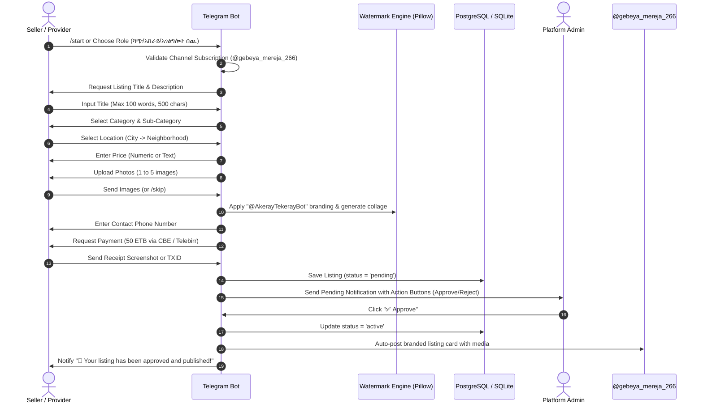

# 📋 Product Requirements Document (PRD)

## Project: Ayebeg (ገበያ) — Telegram Marketplace & Service Ecosystem

**Document Version:** 1.0.0  
**Status:** Approved / Active Baseline  
**Target Market:** Ethiopia (Addis Ababa, Dilla, Regional Urban Centers)  
**Primary Language:** Amharic (አማርኛ) / English  
**Bot Identifier:** `@AkerayTekerayBot`  
**Official Channel:** `@gebeya_mereja_266`  

---

## 1. Executive Summary & Vision

### 1.1 Product Overview
**Ayebeg (ገበያ)** is an end-to-end classifieds marketplace and service discovery ecosystem built natively on top of the **Telegram Bot Platform** and **Telegram Mini Apps (TMA)**. It bridges the gap between Ethiopian sellers/landlords/service providers and buyers/renters/service seekers through localized, accessible, low-bandwidth conversational commerce in Amharic.

### 1.2 Core Value Proposition
- **Frictionless Onboarding:** Operates entirely inside Telegram without requiring separate app downloads or high data consumption.
- **Localized Amharic Search:** Built-in phonetic/fuzzy normalization solving Amharic homophone spelling disparities across Ethiopian keyboards.
- **Trust & Verification:** Semi-automated manual verification flow for payment transfers (CBE / Telebirr), watermarked images to protect intellectual property, and channel cross-posting for viral discovery.
- **Affordable Monetization:** Flat, accessible listing and renewal fee model (50 ETB) targeted at local micro-entrepreneurs, homeowners, and service workers.

---

## 2. Market Problem & Opportunity

### 2.1 Problem Statements
1. **Disorganized Social Selling:** Real estate and classifieds in Ethiopia are fragmented across unstructured Telegram channels and Facebook groups with no searchability, stale listings, and scam risks.
2. **Keyboard Homophone Mismatches in Amharic:** Words with interchangeable Amharic letters (e.g., ሀ/ሐ/ኀ/ሃ/ሓ, አ/ዐ/ዓ, ሰ/ሥ) frequently break traditional database text searches.
3. **High Barriers for Standalone Apps:** High mobile data costs and limited device storage prevent users in regional cities (e.g., Dilla, Hawassa, Adama) from downloading heavy native mobile apps.
4. **Photo Theft & Impersonation:** Unprotected property images get scraped and reposted by unauthorized brokers (ደላላ).

### 2.2 Solution Strategy
- Provide a guided conversational workflow for structured listing creation.
- Automatically watermark every listing image with the official bot handle.
- Normalise all search queries and metadata with phonetic equivalence mapping.
- Seamlessly cross-post vetted listings to the broadcast channel `@gebeya_mereja_266`.

---

## 3. User Personas & Target Audience

| Persona | Role | Key Goals & Needs | Pain Points |
|---|---|---|---|
| **Abebe (Landlord / Seller)** | Property / Goods Owner | Wants to list a house/car/electronics quickly, find verified buyers, track listing status. | Doesn't want brokers taking steep cuts or reposting low-quality copies of images. |
| **Sara (Service Provider)** | Plumber / Electrician / Beautician | Wants local visibility in specific sub-cities/neighborhoods, steady customer inquiries. | Struggling to get discovered outside direct word-of-mouth. |
| **Dawit (Buyer / Renter)** | Seeker / Consumer | Filter properties/services by exact neighborhood and budget, contact verified sellers directly. | Wasting time scrolling through thousands of chaotic Telegram channel messages. |
| **Admin / Moderator** | Platform Operator | Validate payments (bank screenshots / TXID), approve/reject posts, manage broadcasts, audit platform health. | Manual workload without streamlined moderation tools. |

---

## 4. User Stories & Core Workflows

### 4.1 Sellers, Landlords & Providers (Suppliers)
- **US-01 [Post Listing]:** As a seller/landlord, I want to submit a listing with title, category, city, neighborhood, price, contact phone, and up to 5 photos so that buyers can find my offer.
- **US-02 [Photo Branding]:** As a seller, I want my photos automatically watermarked with `@AkerayTekerayBot` to protect my listing from unauthorized reposting.
- **US-03 [Listing Management]:** As a seller, I want to view my active listings, renew expiring service listings (30-day lifecycle), or unlist items that are sold/rented.
- **US-04 [Market Demand Insights]:** As a supplier, I want to view "Looking For" requests submitted by seekers so I can proactively offer my services or goods.

### 4.2 Buyers, Renters & Seekers (Demand Side)
- **US-05 [Fuzzy Amharic Search]:** As a buyer, I want to search listings using text queries in Amharic and find relevant results regardless of homophone character variations.
- **US-06 [Location-Based Filtering]:** As a seeker, I want to filter listings by City (e.g., Addis Ababa, Dilla) and specific Neighborhoods (e.g., Bole, Yeka, Samara, Mazeriva).
- **US-07 [Listing Discovery & Gallery]:** As a seeker, I want to browse paginated listings, view multi-photo collages, or launch the Telegram Mini App photo gallery for smooth touch navigation.
- **US-08 [Submit "Looking For" Request]:** As a seeker who cannot find what they want, I want to submit a custom request specifying category, budget, location, and description.
- **US-09 [Direct Seller Contact]:** As a buyer, I want direct access to phone numbers and Telegram deep links (`t.me/bot?start=view_<id>`) to close deals quickly.

### 4.3 Administrators (Platform Operations)
- **US-10 [Payment Approval Flow]:** As an admin, I want to review submitted payment receipts (screenshot/TXID), compare with CBE account records, and approve/reject listings with one tap.
- **US-11 [Channel Broadcast Automation]:** As an admin, upon approving a listing, I want the bot to automatically format and publish a polished card with images to `@gebeya_mereja_266`.
- **US-12 [System Health & Metrics]:** As an admin, I want a `/stats` or `/admin` dashboard displaying active users, listings by category, and pending approval queues.
- **US-13 [Mass Broadcast]:** As an admin, I want to send system announcements or promotion messages to all registered users via `/broadcast`.

---

## 5. Functional Requirements & Specifications

### 5.1 Category Hierarchy

```
├── Property / Goods (ሻጭ / አከራይ)
│   ├── 🏠 House / Land (ቤት / መሬት)
│   ├── 🚗 Vehicle (ተሽከርካሪ)
│   ├── 🛋️ Furniture / Household (የቤት ፅቃ)
│   ├── 📱 Electronics (ኤሌክትሮንክስ)
│   ├── 👗 Fashion / Beauty (ፋሽን / ዉበት)
│   └── 📦 Other (ሌላ)
│
└── Services (አገልግሎት ሰጪ)
    ├── 🔧 Home Maintenance & Plumbing (ቤት ነክ)
    ├── 🚗 Automotive / Mechanics (ተሽከርካሪ ነክ)
    ├── 📱 Electronics & Phone Repair (ኤሌክትሮንክስ ነክ)
    ├── 👗 Fashion & Personal Care (ፋሽን / ዉበት ነክ)
    └── 📦 Other Specialized Services (ሌላ)
```

### 5.2 Location Hierarchy (Configurable in `location_options.py`)
- **Addis Ababa & Surrounding (አዲስ አበባ/ዙሪያ):** All sub-cities (Bole, Yeka, Kirkos, Arada, Lideta, Addis Ketema, Nefas Silk Lafto, Kolfe Keranio, Gulele, Akaki Kality, Lemi Kura, Sheger City).
- **Dilla & Surrounding (ዲላ/አካባቢዋ):** Samara, Ebenezer, Mola Golja, Get Smart, Sunshine, Delight, Mazoriya, Menehariya, Kofe, Chichu, Walame, Dara/Machisho, Guangua, Odo Mike.
- **Extensible Registry:** 30+ regional towns pre-configured in lookup tables (Hawassa, Adama, Bahir Dar, Gondar, Mekelle, Dire Dawa, Jimma, Arba Minch, Bishoftu, etc.).

### 5.3 Step-by-Step Listing Creation Flow



### 5.4 Feature Priority Matrix (MoSCoW)

| Feature | Description | Priority |
|---|---|---|
| **Channel Subscription Gate** | Mandatory channel join verification before bot usage | **Must Have** (P0) |
| **Conversational Listing Engine** | Guided state-machine flow with validation (word/photo limits) | **Must Have** (P0) |
| **Amharic Homophone Fuzzy Search** | Database-level phonetic normalization for Ge'ez characters | **Must Have** (P0) |
| **Automated Image Watermarking** | Real-time Pillow branding with `@AkerayTekerayBot` | **Must Have** (P0) |
| **Admin Moderation & Approval** | In-chat review of payment proofs, one-click approve/reject | **Must Have** (P0) |
| **Channel Auto-Publishing** | Real-time publishing to `@gebeya_mereja_266` upon approval | **Must Have** (P0) |
| **30-Day Service Expiry & Renewal**| Automated background lifecycle management for service posts | **Should Have** (P1) |
| **Telegram Mini App Gallery** | Lightweight HTML5/JS touch-enabled image carousel | **Should Have** (P1) |
| **"Looking For" Seeker Board** | Buyer demand board browsable by suppliers | **Should Have** (P1) |
| **Admin Metrics & Broadcast** | `/stats` dashboard and mass messaging `/broadcast` | **Should Have** (P1) |
| **AI Smart Parsing / Categorization** | Gemini 2.0 Flash integration for auto-extracting metadata | **Could Have** (P2) |
| **Automated Payment Gateway** | Direct Chapa / Telebirr API webhook reconciliation | **Won't Have (Now)** (P3) |

---

## 6. Technical Architecture & Data Model

### 6.1 Architecture Overview

```
                      ┌───────────────────────────────────────────────┐
                      │             Telegram User Interface           │
                      │   (Telegram Chat + Telegram Mini App Gallery) │
                      └───────────────────────┬───────────────────────┘
                                              │ Webhook / Polling
                                              ▼
                      ┌───────────────────────────────────────────────┐
                      │        Core Application Layer (main.py)       │
                      │  - python-telegram-bot v22.8 (Async Engine)   │
                      │  - ConversationHandler State Machine          │
                      │  - Channel Membership Verification            │
                      │  - Admin Approval / Broadcast Handlers        │
                      └───────┬───────────────┬───────────────┬───────┘
                              │               │               │
            ┌─────────────────┴─┐   ┌─────────┴─────────┐   ┌─┴─────────────────┐
            │ Image Processing  │   │  Amharic Fuzzy    │   │  Storage & DB     │
            │  (watermark.py)   │   │  Normalization    │   │  (database.py)    │
            │ - Pillow Engine   │   │  - Letter Mapping │   │ - SQLite3 (dev)   │
            │ - Watermarking    │   │  - Query Matcher  │   │ - PostgreSQL      │
            │ - Collages        │   │                   │   │   (production)    │
            └───────────────────┘   └───────────────────┘   └───────────────────┘
```

### 6.2 Database Schema Specification

#### `users` Table
| Field | Type | Modifiers | Description |
|---|---|---|---|
| `id` | SERIAL / INT | PRIMARY KEY | Internal user row ID |
| `telegram_id` | BIGINT | UNIQUE NOT NULL | Telegram 64-bit user identifier |
| `username` | TEXT | NULLABLE | Telegram `@username` handle |
| `role` | TEXT | DEFAULT `'user'` | Role (`'user'`, `'admin'`) |

#### `listings` Table
| Field | Type | Modifiers | Description |
|---|---|---|---|
| `id` | SERIAL / INT | PRIMARY KEY | Unique listing identifier |
| `owner_id` | BIGINT | NOT NULL | Telegram ID of creator |
| `title` | TEXT | NOT NULL | Item/service title & description |
| `location` | TEXT | NOT NULL | Normalized City + Neighborhood string |
| `price` | TEXT | NOT NULL | Stated price or quotation terms |
| `photo_file_id` | TEXT | NULLABLE | Pipe-separated Telegram `file_id`s |
| `contact_phone` | TEXT | NOT NULL | Contact phone number |
| `property_purpose` | TEXT | NULLABLE | `'rent'`, `'sale'`, or service specification |
| `listing_type` | TEXT | DEFAULT `'property'` | `'property'`, `'service'`, or `'looking_for'` |
| `status` | TEXT | DEFAULT `'pending'` | `'pending'`, `'active'`, `'rejected'`, `'expired'` |
| `fee_amount` | REAL | DEFAULT 50.0 | Fixed listing fee in ETB |
| `transaction_id` | TEXT | NULLABLE | CBE / Telebirr transaction reference or screenshot ID |
| `created_at` | TEXT / TIMESTAMP | NOT NULL | Timestamp of creation (`YYYY-MM-DD HH:MM:SS`) |
| `last_checked_at` | TEXT / TIMESTAMP | NULLABLE | Timestamp for 30-day renewal cycle checks |
| `channel_message_id` | BIGINT | NULLABLE | Message ID of auto-posted channel message |
| `channel_notified_at`| TEXT / TIMESTAMP | NULLABLE | Timestamp when broadcast to channel occurred |

#### `alerts` (Looking For) Table
| Field | Type | Modifiers | Description |
|---|---|---|---|
| `id` | SERIAL / INT | PRIMARY KEY | Unique alert ID |
| `telegram_id` | BIGINT | NOT NULL | Seeker's Telegram ID |
| `category` | TEXT | NOT NULL | Requested category |
| `city` | TEXT | NOT NULL | Requested city |
| `neighborhood` | TEXT | NULLABLE | Target neighborhood |
| `property_purpose` | TEXT | NULLABLE | Buy, rent, or service need |
| `description` | TEXT | NOT NULL | Free-form seeker request |
| `created_at` | TEXT / TIMESTAMP | NOT NULL | Submission timestamp |

---

## 7. Business Logic & Edge Case Handling

### 7.1 Input & Rate Limit Constraints
- **Title / Description Length:** Max 100 words and 500 characters. Extra spaces and newlines count toward character limits but are deduplicated for word counts.
- **Photo Upload Limit:** Max 5 photos per listing. Upon receiving the 5th photo, the bot automatically transitions to the next step without requiring manual click of "Done".
- **Session Timeout:** 15-minute conversation inactivity window; sessions auto-terminate gracefully to release memory.
- **Persistence:** Pickle-based conversation persistence (`bot_data.pickle`) ensures user flows survive server restarts and redeployments.

### 7.2 Amharic Fuzzy Normalization Rules
To guarantee resilient search results across heterogeneous Ethiopian mobile keyboards, the database query layer normalizes phonetic homophones according to the following mapping table before executing sub-string matches:

| Character Family | Input Variants (Collapsed) | Canonical Target |
|---|---|---|
| **Ha (ሀ) Family** | ሃ, ሐ, ሓ, ኃ, ኀ | **ሀ** |
| **Alef (አ) Family** | ዐ, ዓ, ኣ | **አ** |
| **Se (ሰ) Family** | ሥ, ሤ | **ሰ** |
| **Tse (ጸ) Family** | ፀ | **ጸ** |

---

## 8. Non-Functional Requirements (NFRs)

### 8.1 Performance & Scalability
- **Response Time:** Bot interactive keyboard latency < 500ms under standard polling/webhook operations.
- **Image Generation:** Watermarking and collage rendering < 1.2s per 5-photo batch using Pillow multithreading.
- **Concurrency:** Asynchronous `python-telegram-bot` event loop handling up to 100 concurrent user sessions.

### 8.2 Reliability & Availability
- **Health Check Endpoint:** Built-in lightweight HTTP server listening on configured `PORT` (7860) responding `200 OK` for cloud platform liveness probes (Railway / Hugging Face Spaces / Koyeb).
- **Graceful Webhook Fallback:** Dual operating mode (`BOT_UPDATE_MODE=webhook|polling`) for zero-friction local development and high-uptime production deployments.

### 8.3 Security & Privacy
- **Environment Isolation:** All sensitive credentials (`BOT_TOKEN`, `DATABASE_URL`, `ADMIN_IDS`, `WEBHOOK_SECRET`) injected via environment variables.
- **Admin Verification Gate:** Restrict all moderation endpoints (`/admin`, `/stats`, `/admin_pending`, `/broadcast`, approval callbacks) strictly to authorized user IDs in `ADMIN_IDS`.
- **Database Safety:** Parameterized queries across both SQLite and PostgreSQL backends to eliminate SQL Injection risks.

---

## 9. Metrics, Analytics & Success KPIs

| Metric Category | Key Performance Indicator (KPI) | Target (6 Months Post-Launch) |
|---|---|---|
| **User Acquisition** | Total Registered Users (`users` count) | > 25,000 users |
| **Channel Growth** | `@gebeya_mereja_266` Subscribers | > 15,000 subscribers |
| **Listing Throughput** | Approved Listings per Month | > 1,200 active listings |
| **Monetization** | Monthly Fee Revenue (50 ETB / post) | > 60,000 ETB / month |
| **Moderation Speed** | Average Time to Approve/Reject | < 15 minutes during business hours |
| **Seeker Engagement** | "Looking For" Requests Submitted | > 500 requests / month |

---

## 10. Future Product Roadmap

### Phase 1: Core Marketplace (Current Baseline - v1.0)
- [x] Multi-category listing engine with 5-photo upload limit.
- [x] Real-time Pillow image watermarking (`@AkerayTekerayBot`) and collage builder.
- [x] Manual payment verification flow (50 ETB via CBE).
- [x] Admin approval dashboard & auto-posting to `@gebeya_mereja_266`.
- [x] Telegram Mini App touch gallery for rich media display.
- [x] Amharic phonetic fuzzy search.

### Phase 2: Automation & Enhanced Monetization (v1.5)
- [ ] **Automated Payment Webhooks:** Integrate Chapa / Telebirr direct checkout for instant zero-wait listing approvals.
- [ ] **Premium Featured Listings:** Paid pin placement (top of search results and pinned channel messages).
- [ ] **Saved Searches & Instant Alerts:** Automated notification when a listing matching a saved seeker query is approved.

### Phase 3: AI-Powered Commerce & Expansion (v2.0)
- [ ] **Gemini 2.0 Flash Smart Parser:** Natural language voice-to-text listing creation (speak in Amharic -> auto-populate category, location, and price).
- [ ] **AI Scam & Duplicate Detector:** Automatic image hashing and text duplicate filtering before admin review.
- [ ] **Multi-Language Expansion:** Add Afaan Oromoo and Tigrinya localized UI strings and phonetic normalizers.

---

## 11. Sign-off & Revision History

| Version | Date | Author | Description of Changes |
|---|---|---|---|
| **1.0.0** | August 2026 | Antigravity AI / Gebeya Product Team | Initial Baseline PRD covering Bot, Mini App, Amharic Search, and Operations. |
